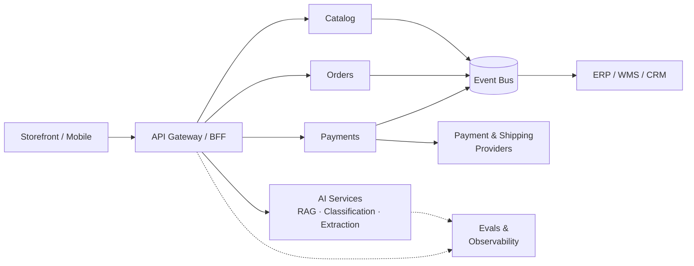

# Iago Cedran

**Software Architect · AI Engineer**
Brazil · [LinkedIn](https://www.linkedin.com/in/iagocedran)

> *Now — April 2026:* building evaluation pipelines for LLM features that run in production, and quietly migrating a Magento monolith toward bounded contexts.

---

## What I work on

I design and evolve systems where **eCommerce, integration complexity, and scale** meet — the kind of platform where a wrong architectural call shows up months later as a migration bill. Most of my background is on the Magento / PHP side of that world, but the interesting work is rarely about the framework: it's bounded contexts, event flows, idempotency, and choosing the smallest architecture that survives the next 18 months.

Lately I'm focused on bringing **LLMs into existing systems** where they earn their keep — retrieval, classification, structured extraction — and treating them like any other dependency: with evals, observability, and guardrails.

A sketch of the kind of platform I tend to design — bounded contexts behind a thin BFF, async edges over an event bus, AI services as just another dependency with its own evals.

## Recent focus

- **Architecture**: domain-driven design, modular monoliths vs. service decomposition, event-driven patterns, ADRs as a habit, C4 for communication.
- **AI engineering**: RAG over messy domain data, agent tool-use, evaluation pipelines, prompt caching and cost shaping, MCP for tool composition.
- **Platform quality**: observability that pays for itself, security-by-design, and the boring reliability work that makes the impressive stuff possible.

## How I think about the stack

I'm pragmatic. The stack is a means, not an identity:

- **Backends I reach for**: TypeScript/Node, Python, PHP/Laravel.
- **Data**: PostgreSQL first, Redis where it earns its place, message brokers when async is the right answer (not before).
- **Cloud**: AWS by default; comfortable on GCP and Azure. Containers and Kubernetes when complexity justifies them.
- **AI/LLM**: Anthropic and OpenAI APIs, embeddings + pgvector/Qdrant, evals before vibes.
- **eCommerce**: deep familiarity with Magento 2 — including when *not* to use it.

## Principles

- Architecture decisions deserve writing — ADRs over tribal knowledge.
- Trade-offs are the work; "best practices" without context are folding chairs.
- Skeptical of agent demos that don't survive evals.
- Boring tech for the load-bearing parts; novelty where the upside is asymmetric.

---

> The job isn't to pick the best technology. It's to pick the one whose failure modes you're willing to live with.

---

## Connect

[LinkedIn](https://www.linkedin.com/in/iagocedran)
